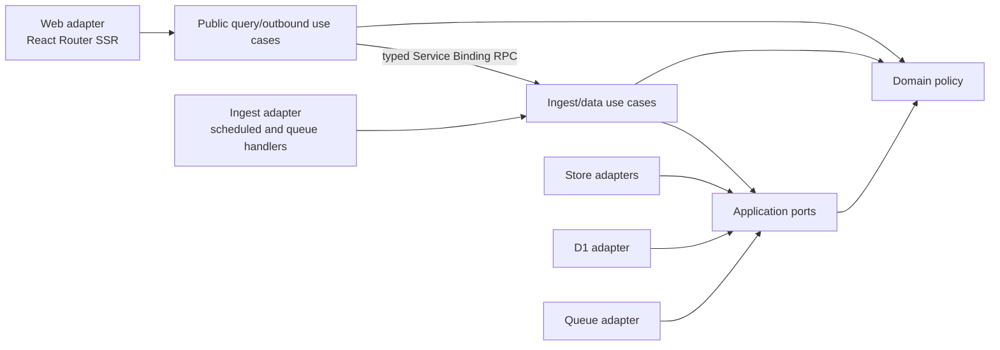
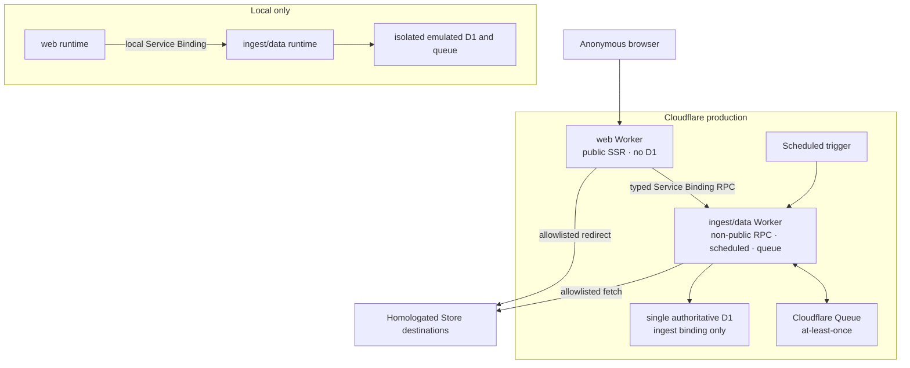
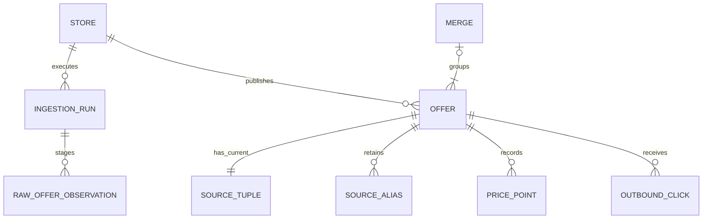

# Architecture Spine — FilaTracker

## Design Paradigm

Hexagonal modular monolith. Domain and application policy are runtime-neutral; HTTP, routing, queues, Store access, and D1 are adapters. Ingestion is a deterministic pipes-and-filters pipeline whose stages own discovery, extraction, normalization, validation, matching, publication, and history capture.



Arrows mean “may depend on.” Domain code has no outward dependency; only the non-public ingest/data Worker has a D1 adapter.

## Invariants & Rules

### AD-1 — Hybrid exact search result contract [ADOPTED]

- **Binds:** FR-1–FR-5, FR-9, FR-10; search API, routes, indexing, analytics, QA
- **Prevents:** false Merge grouping and incompatible result units
- **Rule:** Search returns a discriminated `MergeResult | OfferResult`. Before a complete canonical key has two eligible published Offers, each is an `OfferResult`; reaching two promotes a durable `MergeResult`. A promoted Merge never collapses when visible membership falls to one; zero visible members removes it from search while retaining lineage and route. Offer routes remain addressable and link canonically to their Merge when grouped. A Merge requires exact equality of normalized brand + Specific Type + weight; color and diameter never participate, and incomplete-key Offers remain standalone.

### AD-2 — Hexagonal modular monolith and deterministic pipeline [ADOPTED]

- **Binds:** all modules and both runtimes
- **Prevents:** HTTP, Store, queue, and persistence concerns entering normalization, matching, pricing, or publication policy
- **Rule:** Runtime adapters depend inward through application ports; the domain depends on none. Ingestion stages are deterministic and shared across Stores.

### AD-3 — Official React Router Cloudflare starter [ADOPTED]

- **Binds:** web runtime, SSR, routing, build, deployment
- **Prevents:** SPA/API splitting, unofficial framework adapters, and confusing starter ranges with resolved dependencies
- **Rule:** Bootstrap from the official `create-cloudflare` React Router v8 SSR starter. Preserve its `workers/app.ts` web entry and declared semver ranges; the committed lockfile is authoritative for exact resolutions. Project additions or upgrades are reviewed and labeled separately.

### AD-4 — D1 transactional source of truth [ADOPTED]

- **Binds:** Offers, Merges, price history, scrape state, Store state, outbound events
- **Prevents:** dual-write authority across operational stores
- **Rule:** D1 relational tables are authoritative. FTS, Merge membership, and retained raw observations are rebuildable projections/artifacts; the Offer source-identity map, Merge key registry/tombstones, published facts, run/inbox state, and audit lineage are durable and non-disposable.

### AD-5 — Stable persisted Merge projection [ADOPTED]

- **Binds:** FR-5, FR-9, FR-10, routes, reprocessing, search
- **Prevents:** route churn, identity reuse after corrections, and competing Merge ownership
- **Rule:** A durable registry uniquely maps `(canonicalKeyVersion, canonicalKeyFingerprint)` to an opaque stable `mergeId`; allocation follows AD-1 promotion, tombstones are retained, and current membership is rebuildable. Mixed canonical-key versions may not become public: migration builds and validates a shadow projection for every published Offer under the new version, applies reviewed one-to-one/split lineage, then atomically compare-and-swaps the global projection epoch. Ingestion remains on the old version or stages until cutover. Exactly one ID survives only a reviewed one-to-one semantic rename; splits create new IDs and make the old ambiguous resource gone.

### AD-6 — Two Workers from one codebase [ADOPTED]

- **Binds:** runtime permissions, deployment, failure isolation
- **Prevents:** scraper execution, Store access, persistence authority, or ingest credentials entering the public runtime
- **Rule:** Exactly two Workers are deployed: public `web` owns SSR and calls a Cloudflare Service Binding; non-public `ingest` owns authoritative D1, typed data RPC, scheduled work, queues, and Store access. `web` has no D1 binding. RPC startup imports only contract/query/outbound modules; scheduled/queue handlers lazy-load Store code and contain invocation failures. Production deploys canary the RPC surface before activation and retain immediate rollback. This topology accepts `ingest` deployment/runtime unavailability as a shared public-data failure domain and handles it only through AD-25—not as an empty result.

### AD-7 — Declarative Store maps with typed hooks [ADOPTED]

- **Binds:** FR-14, FR-15; Store adapters, homologation fixtures
- **Prevents:** per-Store business-rule forks, non-filament publication, direct membership overrides, robots violations, and production self-repair
- **Rule:** Each Store adapter is a schema-validated, versioned declarative map plus optional typed discovery/extraction hooks and emits only `RawOfferObservation`. Shared stages own identity policy, eligibility, normalization, validation, matching, history, and persistence; Store manifest rules compile only to AD-17 completeness classes. Source-controlled homologated aliases may preserve reviewed Offer or Merge lineage but never assign membership. Robots policy is checked at homologation and every run; disallow, ambiguity, or fetch failure fails closed without bypass.

### AD-8 — Atomic per-Store ingestion promotion [ADOPTED]

- **Binds:** FR-8, FR-13–FR-15; ingestion mutation, availability, history, retries
- **Prevents:** partial visibility, generation regression, mass-unavailability, duplicate history, and commit/ack replay gaps
- **Rule:** One bounded, set-based D1 `batch()` transaction compare-and-publishes the expected Store generation, global projection epoch, support generation, and recovery epoch, then atomically commits Store generation, Offer visibility/availability, effective PricePoints, Merge membership, relational/FTS visibility, terminal run state, and inbox completion. Authoritative-complete runs may publish positives and infer absence; positive-only runs atomically publish observed positive facts but never absence/unavailability; failed, quarantined, or oversized runs publish nothing. Store homologation must prove maximum-volume batch capacity against current D1 limits with an explicit safety margin; an oversized Store remains on its prior generation until an approved architecture change.

### AD-9 — Rebuildable D1 FTS5 search index [ADOPTED]

- **Binds:** FR-1–FR-4; search indexing and reads
- **Prevents:** dual writers, partial rebuild visibility, and an Offer appearing both standalone and merged
- **Rule:** The publication/projection coordinator is FTS's sole writer and uses reviewed explicit SQL, never triggers. FTS holds one versioned document per visible AD-1 result unit. Rebuild captures the authoritative projection epoch, builds and validates a shadow, and cuts over only by compare-and-swap; concurrent publication makes it stale and rejected unless serialized catch-up advances it. Fallback uses the same parser, eligible fields, and identity rules and returns equivalent result identities, or an explicit observed degraded response—never a silent partial index.

### AD-10 — Drizzle persistence boundary and SQL migrations [ADOPTED]

- **Binds:** D1 schema, queries, migrations
- **Prevents:** ORM leakage, competing migration systems, and incompatible two-Worker rollout
- **Rule:** D1 adapters use Drizzle; generated, versioned SQL migrations run through Wrangler, while reviewed explicit SQL owns FTS5 and publication. Domain/application APIs expose no Drizzle types. Releases use expand → migrate → deploy additive ingest RPC/queue consumers accepting N and N-1 → verify → deploy web/producers N → contract. RPC and queue producers emit N only after consumers accept N; rollback emits the prior mutually accepted version. Old result/error variants remain decodable and destructive contraction waits through RPC rollback, queue retention, DLQ/replay, mixed-version, and recovery horizons.

### AD-11 — Local and production environments only [ADOPTED]

- **Binds:** configuration, resources, release flow, Store homologation
- **Prevents:** hidden staging dependencies, production-as-test behavior, and accidental production authority
- **Rule:** Local uses isolated emulated resources and production uses production bindings. Local and CI identities cannot bind production D1, queues, or secrets. Store maps require fixtures and a bounded, read-only, non-publishing production-safe probe before activation.

### AD-12 — Canonical web surface and presentation contract [ADOPTED]

- **Binds:** FR-1–FR-13, FR-16; all web route and component epics
- **Prevents:** route duplication, contradictory result states, broken retained links, and availability-dependent outbound drift
- **Rule:** The web adapter owns `/`, `/search`, `/offers/:offerId`, `/merges/:mergeId`, `/materials/:familySlug`, `/brands/:brandSlug`, and `/out/:offerId`; `/stores` is absent in v1. Offer routes remain addressable and canonically link to a grouped Merge. Merge aliases permanently redirect only to one reviewed survivor; ambiguous splits are gone. Brand/material records use opaque IDs plus durable unique slug aliases and permanent rename redirects. Each dynamic page is composed from one AD-25 page-aggregate RPC snapshot. MVP uses no cross-request cache for generation-sensitive search/detail/browse/outbound responses; only static assets may use shared cache.

### AD-13 — Untrusted-content and product-event privacy boundary [ADOPTED]

- **Binds:** Store ingestion, SSR, outbound analytics, optional search analytics
- **Prevents:** merchant injection, SSRF/open redirects, resource exhaustion, and unnecessary PII retention
- **Rule:** Merchant content is untrusted bounded plain data: never execute/render merchant HTML, and enforce per-fetch, redirect, decompression, parse, field, observation, concurrency, duration, staged-byte, log, FTS, and SSR budgets. Product events and all application-controlled logs, traces, request analytics, and error telemetry use positive allowlists and redact raw query/referrer/destination URL, IP, full User-Agent, stable identifiers, precise device/network data, accounts, secrets, and unrelated payload before emission. Every sink has bounded retention and purge verification before production; platform sinks are configured to the same contract or disabled.

### AD-14 — Invariant verification gate

- **Binds:** CI, Store homologation, migrations, projection rebuilds, releases
- **Prevents:** independently passing unit tests from shipping incompatible matching, retry, or publication behavior
- **Rule:** CI must pass contract/RPC N/N-1 and page-snapshot compatibility, RPC unavailable/exception/deadline/overload/duplicate-command and configured-limit tests, normalizer cutover, result/identity lineage, Store completeness/transition/capacity, extraction/robots, destination-policy, resource budgets, queue replay/DLQ, projection/support/recovery fencing, database invariants, FTS fallback/rebuild, public D1-binding/caller-inventory denial, telemetry redaction/purge, corrected-price reads, recovery, performance, and core accessibility tests before production deployment.

### AD-15 — Canonical versioned contracts

- **Binds:** all persisted, queue, pipeline, and presentation boundaries
- **Prevents:** incompatible nullability, units, enums, provenance, and version evolution across epics
- **Rule:** `src/contracts/` solely owns versioned Zod schemas and inferred types for observations, Offers, Merge registry/membership, PricePoints, Store/Run state, queue/RPC envelopes, page aggregates, and presentation DTOs; `src/domain/identity/` owns versioned source identity policy. Canonical records use explicit `null` for known unknowns; money is positive BRL centavos, mass positive grams, timestamps UTC instants, enums closed/versioned, and derived facts carry applicable Store, run, contract, map, parser/normalizer, observation, and recording provenance. RPC envelopes also carry a random per-request correlation ID that is never reused across requests.

### AD-16 — Immutable Offer identity

- **Binds:** ingestion, history, routes, outbound, replay, and corrections
- **Prevents:** URL changes splitting history, Store identifier reuse, and automatic history conflation
- **Rule:** Shared AD-15 identity policy derives source tuples from canonical reviewed PDP URL plus merchant variant. Each source tuple maps to exactly one Offer; an Offer has exactly one current tuple and may have multiple immutable historical alias/tombstone tuples. Publication requires a compatible continuity fingerprint over normalized brand + Specific Type + weight. Incompatible reuse of an unchanged tuple quarantines and requires reviewed split/new-Offer lineage; it never appends to old history. Compatible URL/source change preserves an ID only through reviewed alias lineage; histories are never auto-merged.

### AD-17 — Single ingestion run coordinator

- **Binds:** scheduler, queue consumers, publication, Store health, and operator replay
- **Prevents:** competing writers, premature completion, late-message mutation, and poison-message limbo
- **Rule:** One application coordinator is the only writer of Run/Store generation and publication/projection state. Legal run flow is `created → discovering → staged → validated → publishing → published`; any nonterminal run may become `failed`, `quarantined`, or `superseded`, and terminal states are immutable. Per-Store manifest rules compile to `authoritative-complete` (all catalog-bearing work succeeded; absence may be inferred) or `positive-only` (bounded omissions; only observed positives may publish); other outcomes publish nothing. Payload references are immutable digest-verified artifacts retained through retry/DLQ/recovery expiry. Inbox rows outlive maximum retry, DLQ/replay, mixed-version, and recovery horizons; poison replay is audited and operator-authorized.

### AD-18 — Store and Offer state semantics

- **Binds:** search, FTS, coverage, detail/history, outbound, availability, and health operations
- **Prevents:** failed snapshots causing OOS and surfaces disagreeing on stale/support state
- **Rule:** Store support state is `active | degraded | unsupported | deactivated`; availability is `available | unavailable | unknown`. `stale` is derived when the Offer’s monotonic last successfully published `observedAt` is older than 48 hours; late observations never rewind that anchor. `active → degraded` is allowed for transient or positive-only failure; `active|degraded → unsupported` requires robots/policy block or homologated broken-map evidence under tunable thresholds; `unsupported → active` requires new homologation, safe probe, and operator activation; any live state may become `deactivated` only by operator, terminal in v1. Every transition is audited and runs through the coordinator as a generation-fenced projection transaction that atomically cuts relational and FTS visibility. Only explicit OOS or authoritative-complete absence marks unavailable. Active/degraded Offers remain visible; unsupported/deactivated leave search, coverage, and outbound but retain detail/history.

### AD-19 — Append-only PricePoint facts

- **Binds:** FR-13, parser corrections, replay, history charts
- **Prevents:** duplicate samples, rewritten history, and price/original-price disagreement
- **Rule:** Publication appends at most one `PricePoint` per Offer/run only when the positive price tuple differs from the prior effective published point; availability-only changes append none. Points carry observed/recorded times, run/parser/source provenance, and correction lineage; `(offerId, runId)` is unique. Corrections append facts and never rewrite history; edges remain within one Offer, acyclic, and have at most one effective successor per corrected position. Current-price and chart reads deterministically fold lineage so corrected facts supersede prior facts at their observed position; superseded facts remain audit-only.

### AD-20 — Owned outbound and destination policy

- **Binds:** ingestion fetch/discovery, `/out/:offerId`, Store activation, and outbound analytics
- **Prevents:** caller-selected redirects, stale unsafe destinations, and analytics blocking navigation
- **Rule:** One shared destination-policy port permits HTTPS only to exact reviewed hosts/ports, with canonical host syntax, no credentials/fragments, public DNS only, Store-scoped path/query composition, and every-hop validation. Web sends only `offerId` through the typed outbound RPC; ingest resolves and revalidates the current destination. Web creates one opaque event ID, owns `waitUntil(recordOutbound)` and may retry only that idempotent command; D1 uniqueness retains deduplication through the event-retention horizon. Event failure never blocks a successfully resolved redirect.

### AD-21 — Bounded public mutation surface

- **Binds:** web routes, search, analytics, abuse controls
- **Prevents:** public administrative authority and unbounded anonymous D1/query cost
- **Rule:** Web can call only versioned AD-25 page-query and fail-open event/outbound RPC methods. The surface exposes no administration, Store transition, publication/projection, migration, queue, arbitrary statement, or raw SQL. Search and every RPC method have configured request/response bytes, rows/history points, cursor/page, execution, CPU/subrequest, and materialization budgets; no unbounded result or stream is permitted. Event commands have budgets, deduplication/sampling, storage caps, and safe shedding. Optional search analytics is disabled by default.

### AD-22 — Database-enforced minimum invariants

- **Binds:** D1 migrations, concurrent Workers, replay, and operator SQL
- **Prevents:** authoritative duplicate or impossible facts
- **Rule:** D1 enforces foreign keys and checks plus uniqueness for Offer source identity, Merge registry fingerprint, one current Merge membership per Offer, `(offerId, runId)` PricePoint replay, inbox idempotency, and Store generation/run transition compare-and-swap. Money/mass facts are positive when non-null; durable lineage, Store/map/run, Offer/history, and membership references cannot dangle.

### AD-23 — Two-Worker authority and compatibility

- **Binds:** runtime configuration, secrets, CI, deployment identities, and release commands
- **Prevents:** privilege bleed, compatibility drift, and production binding from local/CI
- **Rule:** Preserve `workers/app.ts` and add `workers/ingest.ts`, with separate Wrangler configs and deploy commands. `web` binds only the ingest Service Binding, an RPC capability secret, and public-safe config—never D1/queues/schedules/Store secrets/migrations. `ingest` alone binds D1 and ingest resources; its RPC entry is non-public and command methods verify the deployment-scoped capability. Deployment policy and CI permit only the production web Worker as RPC caller and audit the account binding inventory. CI aligns compatibility/limit policy; a separate identity owns migrations/deploy; secrets are encrypted bindings and redacted.

### AD-24 — Health, recovery, and service targets

- **Binds:** operator workflows, Store lifecycle, D1/queue incidents, and release verification
- **Prevents:** unaudited deactivation, blind restore/replay, and silently abandoned performance goals
- **Rule:** The coordinator owns Store-health evidence and audited actor/reason transitions; alert tooling is replaceable. A non-regressing recovery epoch is deployment/config state outside restored D1 and is included in every queue envelope and publish CAS. Recovery pauses work, increments/deploys the epoch before resume, restores D1, validates invariants, rebuilds membership/FTS under the captured projection epoch, and rejects/quarantines every old-epoch delivery. Provisional targets are search p95 <500 ms and detail LCP <2.5 s. Before production, owners approve/test RPO, RTO, Time Travel tier, and export need; D1 export drops/recreates FTS virtual tables.

### AD-25 — Page-atomic RPC and resilience contract

- **Binds:** Service Binding methods, SSR routes, mixed deployments, overload behavior, and public error semantics
- **Prevents:** mixed-generation pages, native exception drift, unsafe retries, and backend failure appearing as no results
- **Rule:** Each dynamic route invokes one bounded page aggregate (`getSearchPage`, `getOfferPage`, `getMergePage`, `getBrowsePage`) that reads one committed projection/support epoch; outbound and event commands are separate. Every method returns a versioned `RpcOutcome<T>` with contract version, epochs, correlation ID, and exactly one outcome: `ok | degraded | invalid | notFound | gone | overloaded | unavailable`. The ingest boundary normalizes native exceptions and enforces per-method deadlines. Web may perform at most one in-budget retry for idempotent queries, never implicit command retries, maps invalid/notFound/gone deterministically, maps overloaded/unavailable to non-cacheable 503 with `Retry-After`, and never substitutes an empty state or stale dynamic response. Server accepts RPC N and N-1; additive server deploy/canary precedes web N activation and contraction waits through rollback.

## Consistency & Security Conventions

| Concern | Convention |
| --- | --- |
| Money and mass | Persist BRL amounts as integer centavos and weight as integer grams; derive R$/kg only from known valid weight. |
| Identity and time | Persist opaque text IDs; serialize and store timestamps in UTC. |
| Contract boundary | Import Zod/RPC schemas from `src/contracts/`; identity derives only through `src/domain/identity/`. Adapters may translate but may not redefine semantics. Unknown canonical fields are explicit `null`; omitted means absent from that contract version. |
| Raw observation | Carries Store/run identity, source URL and variant evidence, observed availability/prices/mass/text, `observedAt`, and map/parser versions; shared identity policy canonicalizes it. It is staged, bounded evidence, never public truth. |
| Offer | Staged Offer is run-scoped and invisible; published Offer is immutable identity plus generation-scoped current facts. Availability and stale are separate; normalized unknowns stay null. |
| Merge | Registry/tombstone owns stable identity and versioned key fingerprint; promotion at two eligible published Offers is durable, and zero visible members hide but do not erase it. |
| Queue envelope | Carries envelope version, recovery epoch, message/idempotency identity, Store/run/generation/projection fencing, kind, attempt provenance, and digest/expiry-bound payload reference. |
| RPC envelope | Versioned page aggregates and idempotent command methods only; carries contract version, projection/support epochs, random request correlation ID, bounded cursor, and typed outcome—no generic execution or persistence escape hatch. |
| Presentation | DTO discriminant is `merge | offer`; one page aggregate owns status, ordering, facets, coverage, canonical links, filters, R$/kg, promotion display, corrected-price folding, and explicit degraded search. |
| Merchant content | Store extracted labels and descriptions as plain text; escape on render and never persist or inject executable merchant markup. |
| Raw observation provenance | Persist bounded structured observations with run, Store, adapter-map, and parser versions; do not retain full merchant HTML as an operational record. |
| Web design system | Seed `app/design-system/` from `DESIGN.md`; all routes consume its tokens and primitives and may not fork route-local color, type, spacing, status, or focus constants. |
| Accessibility | Core search → compare → outbound flows meet WCAG 2.1 AA: keyboard reachability, visible focus, textual status, responsive table semantics, and an announced external transition. |
| Logging and telemetry | Emit only allowlisted structured fields with applicable run/Store/message IDs, stage, outcome, and error code; redact before emission and enforce per-sink retention/purge. |
| Mutation ownership | Ingest/data is the sole D1 owner and the coordinator is the sole authoritative publication/projection writer; web has no D1 binding and invokes only allowlisted RPC. |

### State visibility matrix

| Store state | Search / FTS / coverage | Offer detail / history | Outbound |
| --- | --- | --- | --- |
| active or degraded | Visible, including unavailable/unknown/stale with status | Retained | Allowed after destination revalidation |
| unsupported or deactivated | Excluded | Retained | Denied |

`stale` composes with every availability value. A promoted Merge with one visible member remains a MergeResult; with zero it is absent from search but its route and lineage remain. It is never populated from hidden Offers.

## Stack

Verified 2026-08-07. Starter declarations are ranges; the committed lockfile governs reproducible exact resolutions.

| Category | Name | Declared / baseline | Verified exact resolution |
| --- | --- | --- | --- |
| Starter CLI | create-cloudflare | invocation at 2.70.17 | 2.70.17 |
| Starter dependency | react-router | `^8` | 8.3.0 |
| Starter dependency | React | `^19.2.7` | 19.2.8 |
| Starter dependency | @cloudflare/vite-plugin | `^1.51.0` | 1.51.0 |
| Starter dependency | Wrangler | `^4.119.0` | 4.119.0 |
| Starter dependency | Vite | `^8.0.3` | 8.2.1 |
| Starter dependency | TypeScript | `^5.9.3` | 5.9.3 |
| Toolchain addition | Node.js | `>=22.22.0` | 22.22.0 CI baseline |
| Toolchain addition | pnpm | 11.20.0 | 11.20.0 |
| Project addition | drizzle-orm | 0.45.2 | 0.45.2 |
| Project addition | drizzle-kit | 0.31.10 | 0.31.10 |
| Project addition | Zod | 4.4.3 | 4.4.3 |
| Project addition | Vitest | 4.1.10 | 4.1.10 |
| Project addition | @cloudflare/vitest-pool-workers | 0.20.2 | 0.20.2 |
| Platform capability | Cloudflare D1 FTS5 | official SQL docs 2026-04-21 | supported |
| Platform capability | Cloudflare D1 migrations | official docs 2026-06-08 | supported |

## Structural Seed

### System and deployment



### Core entity relationships



### Source tree

```text
app/
  routes/                 # React Router web adapter and SSR surfaces
  design-system/          # canonical UX tokens and shared primitives
src/
  contracts/              # versioned data, RPC, queue schemas and inferred types
  domain/
    identity/             # shared versioned URL, variant, source-key, continuity policy
    ...                   # entities, value objects, deterministic policy
  application/            # use cases, ports, coordinator, pipeline stages
  adapters/
    persistence/          # ingest-only D1 and Drizzle implementations
    queue/                # versioned queue envelopes and handlers
    service-binding/      # typed web client and non-public ingest RPC target
    stores/               # declarative maps, typed hooks, fixtures
workers/
  app.ts                  # starter-preserved React Router web entry
  ingest.ts               # RPC-safe entry; lazy-loads scheduled/queue handlers
wrangler.web.jsonc        # Service Binding only; explicitly no D1/queue/secrets
wrangler.ingest.jsonc     # sole D1 plus queue/schedule/staging/Store secrets
db/
  migrations/             # versioned SQL
tests/                    # domain, pipeline, adapter, and Worker tests
```

## Operational & Environmental Envelope

| Area | Binding envelope |
| --- | --- |
| Environments | Local and production only; bindings and identities are isolated, and local/CI have no production authority. |
| Deployment unit | Exactly two Workers and one D1: public web has only a typed Service Binding; non-public ingest/data alone binds D1, queue, schedule, staging, and Store secrets. |
| Public resilience | One aggregate RPC supplies each page snapshot. RPC failure is a typed non-cacheable error; ordinary scrape invocation failure is contained, while ingest deployment/runtime failure is an accepted shared data-serving failure domain with canary and rollback. |
| Ingestion health | One coordinator, two-class manifest, projection/support/recovery fencing, retained inbox/payload, quarantine/DLQ, and audited replay per run. |
| Store lifecycle | The AD-18 graph governs evidence and authority; every transition atomically cuts relational and FTS visibility. |
| Release gate | Homologation fixtures, safe probe, and maximum-volume D1 batch proof with safety margin precede activation; consumers accept N/N-1 before producer N activates. |
| Recovery | External non-regressing recovery epoch rejects pre-recovery queue deliveries; projection-epoch CAS governs membership/FTS rebuild and FTS is recreated around exports. |
| Cache and routes | Dynamic search/detail/browse/outbound responses are not cross-request cached in MVP; static assets use immutable cache keys. |
| Verification | CI exercises identity continuity, result lifecycle, completeness, capacity, replay/version horizons, projection/recovery CAS, RPC N/N-1, snapshot/error/limit behavior, authority, telemetry, and accessibility. |

## Capability → Architecture Map

| Capability / Area | Lives in | Governed by |
| --- | --- | --- |
| FR-1–FR-4 Search, browse, filter, sort | web routes, page-aggregate RPC, ingest-owned D1 read/FTS adapters | AD-1, AD-2, AD-4, AD-6, AD-9, AD-21, AD-23, AD-25 |
| FR-5–FR-10 Comparison, trust, taxonomy, exact Merge | web presentation, matching, registry/membership projection | AD-1, AD-5, AD-9, AD-12, AD-15, AD-18 |
| FR-11, FR-12, FR-16 Outbound and analytics | typed idempotent outbound/event RPC, destination policy, bounded product events | AD-12, AD-13, AD-20, AD-21, AD-23, AD-25 |
| FR-13 Offer price history | publication pipeline, append-only facts, detail route | AD-8, AD-16, AD-19, AD-22 |
| FR-14, FR-15 Store coverage operations | Store adapters, manifest compiler, coordinator, health/evidence model | AD-7, AD-8, AD-17, AD-18, AD-24 |
| FR-17 Store-provided promotion | extraction schema, validation, domain pricing policy | AD-2, AD-7, boundary-validation convention |
| Responsive anonymous UX and accessibility | React Router web adapter and canonical design system | AD-3, AD-12, AD-14; EXPERIENCE.md and DESIGN.md |
| Observability and retry safety | coordinator, retained inbox/payload, quarantine/DLQ, redacted telemetry | AD-8, AD-13, AD-14, AD-17, AD-24 |
| Shared contracts and deployment | `src/contracts`, identity policy, RPC boundary, D1 constraints, Worker configs | AD-6, AD-10, AD-15, AD-22, AD-23, AD-25 |

## Deferred

- Exact normalization dictionaries, aliases, and parser algorithms — decide with domain fixtures; every version change still follows AD-5 global shadow/CAS cutover.
- Exact Store map schema and per-Store typed hooks — decide during adapter implementation and homologation.
- Scrape cadence, queue topology, batch sizes, measured retry/backoff, and DLQ thresholds — tune without shortening AD-10/AD-17 payload, inbox, decode, replay, or recovery horizons.
- JSON-LD versus browser fallback, robots retrieval mechanics/evidence, and numeric Store rate/resource budgets — decide during homologation without weakening fail-closed policy.
- Relational columns, secondary indexes, FTS tokenizer, and bounded query grammar syntax — decide with migrations and acceptance fixtures while preserving AD-22.
- Any future dynamic read/SSR cache — adopt only with a new generation-validation or realizable invalidation AD; MVP keeps it disabled.
- Numeric analytics, telemetry-sink, and structured-observation retention periods — configure and purge-test before production under AD-13/AD-21.
- Exact RPO/RTO and external export cadence — approve and restore-test before production under AD-24.
- Affiliate parameters and disclosure activation — deferred until product enables monetization.
- SEO surface depth, optional `/stores`, and numeric outbound-click launch target — remain product decisions.
